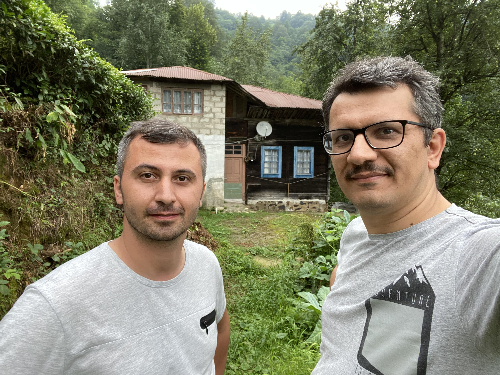
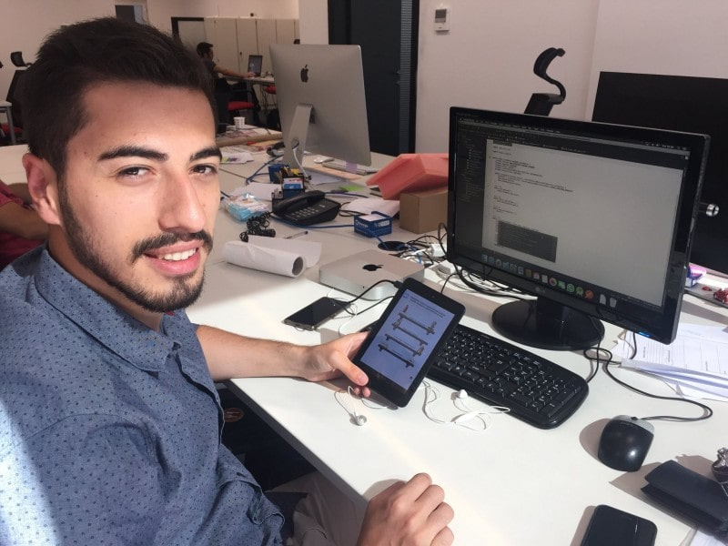
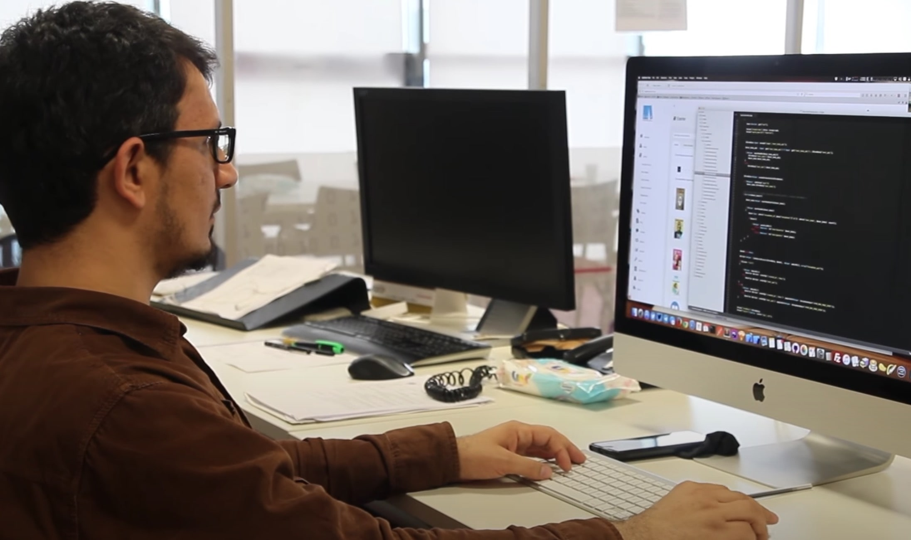
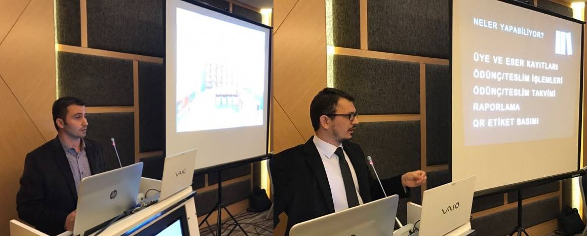
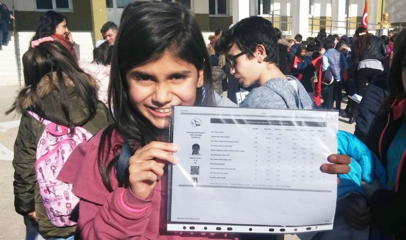
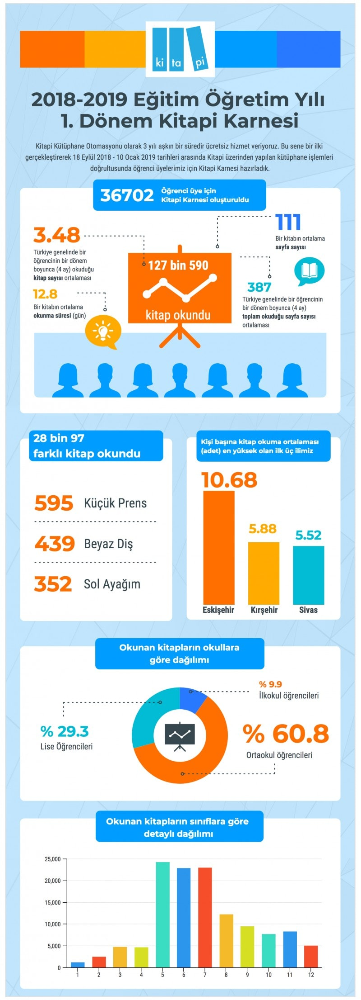
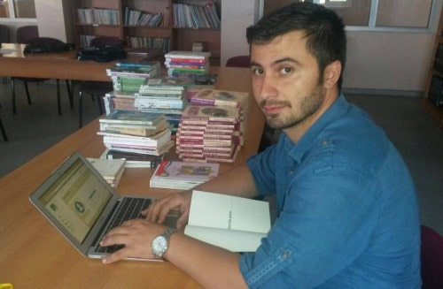

### Bize kendinizden bahsedebilir misiniz? Kimsiniz, ne yapıyorsunuz?

Öncelikle platformunuzda bize yer verdiğiniz için çok teşekkür ederim. İsmim . Rizeliyim. 2001  Elektrik-Elektronik Mühendisliği mezunuyum. 20 yıldır profesyonel olarak yazılım sektöründe  üzerine çalışmaktayım.

### Yazılıma nasıl başladınız?

Ortaokul son sınıftayken (1993) İstanbul'a gelmiştim. Burda dayımla tanıştım. Mağazasındaki bilgisayarları bana gösterdi. Ticari bir yazılım kullanıyordu. Yanında çalışan bir eleman aynı zamanda programcıymış. Onun bana verdiği  kitabı ve  CD'si ile yazılım dünyasına girmiş oldum. 

### Yazılım öğrenmek isteyenlere tavsiyeleriniz nelerdir?

Tavsiye verecek konumda değilim ancak bir kaç tespitimi paylaşayım.

Yazılım öğrenmenin yaşı olmadığını öğrendim. Kırk yaşında yazılıma başlayıp altı yıl içerisinde güzel bir konuma gelenler var. PHP'yi kitaplarından öğrendiğim Hakkı abi (Dr. Hakkı Öcal) bu kitapları 50'li yaşlarında yazmıştı.

Kendi mesleğiniz yazılım öğrenmenize mâni değil. Doktor olup, polis olup, avukat olup yazılım öğrenen ve yazanlar var. Hakkı abi buna da güzel bir örnek. Kendisi yıllarca Türkiye'de yazı işleri müdürlüğüne kadar gazetecilik yapmıştı. Sonra ABD'de profesyonel olarak yazılımcı oldu, üniversitelerde ders verdi.

Yazılım öğrenmek için kursa gitmek şart değil. Yirmi yıl önce internet bu kadar gelişmemişken, YouTube, ,  gibi platformlar yokken programcılığı kitaplardan öğrenebiliyorsak şimdi hayli hayli öğrenebiliriz. Kurs bana daha çok spor yapamayıp, spor kulübüne para verince spor yaparım diye düşünmek gibi geliyor. Ama bu ifadelerim kurslar tamamen kullanışsız, faydasız diye anlaşılmasın. Eğer yukarıda saydığım kaynaklarda ilgilendiğiniz programlama diline dair aradığınızı bulamıyorsanız ve bunun bir kursu varsa o zaman deneyebilirsiniz. Ben de böyle yaptım. 2010'da iOS programlamaya girmek istedim. Yıllardır web çalışan biri olarak zorlandım. Daha doğrusu işin ABC'sini bilememek beni zorladı. Sıfır tecrübeyle kopyala yapıştır yaparak ilk uygulamamı (TGRT-FM) yayına aldım. O zamanlar iOS için yeterli Türkçe kaynak yoktu. Yabancı kaynaklardan da yeterince faydalanamıyordum. Çareyi kursa gitmekle buldum. İşin temellerini öğrendiğimde gerisi çorap söküğü gibi geldi. On yıl sonra şimdi Javascript dünyasına giriş yaptığımda kursa ihtiyaç duymadım. Çünkü artık yüzlerce yerli yabancı kaynak var.

### Kitapi ilk girişiminiz mi? Varsa önceki girişimlerinizden bahsedebilir misiniz?

Kitapi'den önce de bazı denemelerimiz oldu. 2008 idi sanırım. Pixi diye bir yazılım hazırlamıştık. Bununla kendi web sitenizi kod yazmadan oluşturabiliyor, içerisindeki üç-dört temadan birini seçip sitenizi özelleştirebiliyordunuz.  gibi ama çok daha amatördü ayrıca kod indirilmiyor, kendi sunucumuzda çalışıyordu. "Kobilere web sitesi zorunluluğu geldi" haberleri üzerine Pixi'yi bölümlere ayırdık. PixiKobi, PixiHobs (Her Okula Bir Site) gibi alt projeler çıkardık. Bunlardan bilhassa okul siteleri iyi gidiyordu. Çok cüzi, komik denebilecek bir ücret alıyorduk. Okulların zaten maddi imkanları yoktu. Neyse ki okul domainleri -k12.tr- 5 TL gibi ucuz bir fiyata satılıyordu. O yüzden müdürleri ikna etmem kolay oluyordu. Bir süre sonra MEB okullara 5 MB ücretsiz hosting alanı ve meb.k12.tr altında ücretsiz  vermeye başlayınca müdürler oraya gitti. :) Pixi de hayal oldu. 

### Kitapi'den ve nasıl ortaya çıktığından bahsedebilir misiniz?

Kitapi 2015'de ihtiyaçtan ortaya çıktı. Kitapi projesindeki ortağım ve kuzenim  -kendisi öğretmendir- okulundaki kütüphaneyi ayağa kaldırmak istiyordu. Bunun için bir yazılım yapabilir miyiz diye sormuştu. Daha önceki görev yerlerinde de ufak tefek yazılım ihtiyacı olduğunda ben de yardım etmeye çalışmıştım. Bu kez acele etmemesini söyledim, belki daha büyük bir şey yazarız, sadece onun okulunu değil başka okulların da, hatta halk kütüphanelerinin de ihtiyacını görürüz diye düşündük. Çünkü kısa bir süre önce Gönen'deyken ilçe kütüphanesinde bir kitap sormuştum ve görevli kadın, önünde bilgisayar olduğu halde raflardan kendim bakmam gerektiğini söylemişti. Kitaplar bilgisayara kayıtlı değildi. Muhtemelen pahalı olduğu için herhangi bir yazılım kullanmıyorlardı. İşte bu iki olay üst üste gelince belki bu ihtiyaçları temel ölçüde giderecek ve herkesin erişebilmesi için ücretsiz olacak bir yazılım hazırlarız diye düşündük. Böyle ortaya çıktı. Ticari bir proje değildi yani.

> *Kitapi Kurucuları: Sefa Avcılar, Hasan Civelek*

### Kitapi kaç kişilik bir ekipten oluşmaktadır ve görev dağılımı nasıldır?

Kitapi iki kişilik bir ekipten oluşuyor. Ben yazılım tarafına bakıyorum, Sefa Bey de destek ve iş geliştirme tarafına bakıyor diye özetleyebiliriz. Kitapi ticari bir girişim olmadığından gönüllü olarak bu işi yapıyorduk. Zaman zaman başka arkadaşlarımızdan da destek aldık. Örneğin Android uygulaması nasıl yazılır bilmediğimiz için bu işi aynı işyerinde çalıştığımız arkadaşlarımızdan rica etmiştik ve sağolsunlar ücret talep etmeden hem telefon hem de tablet uygulamalarını hazırlamışlardı. Bu uygulamaları zamanla güncelleyemediğimiz için her iki platformdan da kaldırıldılar maalesef. İnşallah tekrar oluşturacağız.

> *Gönüllü Android geliştiricimiz Murat Korkmazoğlu*

### Kitapi ilk müşterisini nasıl elde etti?

Bundan önce şunu ifade edeyim. Biz Kitapi'yi 2015'te gönüllü, ücretsiz bir proje olarak başlattık. Kısa bir sürede bilhassa okullardan teveccüh olunca zamanla kaynaklarımız yetmemeye başladı. Herhangi bir yerden ödeme de almıyorduk. Zaten istesek de resmi olarak alamazdık. Çünkü bir şirket değildik. Ama hedefimiz şirket kurmaktı. Dolayısı ile sadece sponsor arayışında bulunduk ilk yıllarda. Sağolsun kütüphanecilikle ilgili bazı firmalar bize küçük çapta sponsor oldular. Biz de onların ücretsiz yazılım çözümü olduk :) Profesyonel rakiplerimiz yıllık 10.000 TL gibi fiyatlar isterken biz hiç para talep etmiyorduk. Bu da pek çok müşterinin işine geliyordu. Biz nihayet 2020'de kendi şirketimizi kurabildik. Daha doğrusu bir teknoloji şirketi kurduk ve Kitapi bu şirketin ürünlerinden biri oldu. Kitapi'nin mağazasından alışveriş yapan ilk müşterimiz Hatay'dan Metin beydi. Kitapi sticker'i almıştı.

> *Kitapi'nin İlk Siparişi*

### Kitapi'nin geliştirilme sürecinde hangi araçları veya kütüphaneleri kullandınız ve nasıl bir süreç izlediniz?

Kitapi'yi  ile kodladık. 2020'de kurduğumuz kendi şirketimiz olmakla beraber aslında on beş yılı aşkın bir süredir zaten bir teknoloji firmasında yazılım geliştirici ve direktör olarak çalışıyorum. Bu firmada uzun yıllardır  kullanıyorduk. Şirkette dahil olduğum ekip Ar-Ge ekibi olduğu için yeni bir şey denemek genelde bizim ekibe nasip oluyordu. Kısa bir süre beraber çalıştığımız Türkiye'de PHP kullanıcılarının yakından tanıdığı  bize sık sık Laravel'i övüyordu :) Övdüğü kadar da varmış. İncelediğimde çok beğendim ve bir projede kullanmak istedim. Çalıştığım şirket kendi projelerimizi de geliştirmemize imkan veren, bunun çalışanların ve şirket know-how'unun gelişmesinde önemli rol aldığına inanan bir felseye sahip olduğu için Laravel'i Kitapi projesinde kullandım. Böylece kendimize bir proje çıkartırken çalıştığımız şirkete de yeni bir framework yeteneği katmış olduk. Geçen altı sene içerisinde çalıştığımız şirketteki yeni projelerin hemen hepsi Laravel ile yazıldı.

Tabi Laravel'i yeni öğrendiğimiz için Kitapi'de çok acemilik yaptığımız yerler oldu. O nedenle yeni sürümünü bir süredir yazmaya gayret ediyoruz. Yeni sürümde  +  frameworklerini kullanıyoruz. Backend ve Frontend yapılarını birbirinden ayırdık.Yeni sürümde çoklu dil desteği sunuyoruz. Backend API tabanlı geliştirildiği için mobil uygulamalarımızı hazırlarken bize büyük kolaylık sağlayacağını düşünüyoruz. 

> *Kitapi kodlarken: Aslında bir video röportaj sırasında kodluyormuş gibi yaparken.*

### Kitapi'yi geliştirirken ve tasarlarken karşılaştığınız zorluklar neler oldu ve bu zorlukları nasıl aştınız?

İlk sürümde fazla bir problemle karşılaşmadık. Hem yeni bir framework öğrenmenin verdiği heves, hem de o zaman diğer işlerimizin çok yoğun olmaması hızlıca geliştirip yayına çıkmamızı sağladı. Kütüphanecilik pek bilmediğimiz bir alan olduğu için profesyonel kütüphaneci tanıdıklarımızdan bilgi aldık.  kategori sistemini öğrendik. Bunu projemize uyguladık. Fakat "Kitapi profesyonel bir kütüphane yazılımıdır" diye bir iddiamız hiç olmadı. Çünkü profesyonel kütüphane yazılımları sadece kütüphanecilere yönelik hazırlanıyordu. Biz herkesin kullanabileceği ve çok temel fonksiyonları yerine getirebilecek bir yazılım hazırlamak istedik. Kitaplar kaydedilsin, üyeler kaydedilsin, kim hangi kitabı almış, bu takip edilebilsin. Asıl üç temel fonksiyon bunlar idi bizim için. Tabi bunun dışında pek çok özellik daha ekledik. Bazı ufak tefek özellikler kullanıcıların talepleri doğrultusunda geldi. Mesela okullarda teslim edilmeyen kitaplar büyük sorun oluyordu. Bunların kimlerin elinde olduğu, bu öğrencilerin hangi sınıflarda olduğu gibi bir liste gerekiyordu. Biz normalde üye bilgisi tutuyorduk ama bunun yanısıra sınıf ve numara bilgisi de tutmaya başladık. Sınıfları her sene bir artırabilecek bir buton koyduk, vs. Tabi bu fonksiyonlar okul dışındaki üyeler için anlamsız oluyordu ama Kitapi'yi kullanan kitlenin büyük bir çoğunluğu okullar olduğu için bunları Kitapi'ye katmak bizim için değerliydi.

Karşılaştığımız bir diğer zorluk da bazı öğretmenlerin her sene, eski verileri silmek istemesi. Bunlar bizim için önemli verilerdi. Bu veriler Milli Eğitim Bakanlığında bile yok :) Biz Korona öncesi son iki yılda Kitapi Karnesi diye bir rapor verdik her üyeye. O raporda öğrenci olan üyeler kendi kitap okuma istatistiklerini görebildiği gibi, şubesinde, sınıfında, okulunda, ilçesinde ve ilinde ortalamanın neresinde olduğunu da görebiliyordu. Öğretmenler bu karneleri çıktı alıp öğrencilerine verebiliyordu. O nedenle bu bilgilerin kaybolmaması için öğretmenlere -daha doğrusu kütüphane sorumlularına- eski verileri silmemeleri gerektiğini anlatmaya çalışıyorduk.

> *2016 Eğitim Teknolojileri Zirvesi, Ankara*

### Kitapi'yi büyütmek için ne tür pazarlama stratejileri uyguladınız? Uyguladığınız pazarlama stratejilerinden ne tür sonuçlar elde ettiniz?

Aslında bu konuda pek bir çaba harcamadık. Çünkü şirket değildik, bir sermayemiz, bütçemiz yoktu. Kulaktan kulağa, öğretmenden öğretmene duyularak Kitapi kitlesi büyüdü. Buna ek olarak kendi kişisel bloglarımızda reklamlarımızı yaptık. İlk başlarda Facebook'a da reklam verdiğimizi hatırlıyorum. Bunun dışında bir çabamız olmadı. Çünkü çok büyük bir kitleyi Kitapi'yi kullandırmaya kalktığımızda sunucu kaynakları yeterli gelmiyor bizim cebimizden çıkan maaliyet artıyordu.

Ayrıca zaman zaman çeşitli davetler geliyordu. Buralarda Kitapi'yi tanıtarak kitlemizi büyütmeye çalışıyorduk. Örneğin 2016'da Ankarada Eğitim Teknolojileri Zirvesi'ne katıldık. Yine 2016'da Bilişim Yıldızları'nın düzenlediği yarışmada Girişimci / Sosyal Sorumluluk kategorisinde 1’inci olup ödül aldık. Daha sonra Marmara Üniversitesi'nde düzenlenen kütüphanecilikle ilgili bir etkinlikte yine Kitapi'yi tanıtma fırsatı bulduk.

> *Bilişim Yıldızları 2016*

### Kitapi'nin masrafları nelerdir?

Hâlihazırda yayında olan Kitapi'nin sunucu masrafı dışında düzenli bir masrafı yok. Korona nedeniyle okullar ve okul kütüphaneleri de eski randımanıyla faaliyet göstermedikleri için iki yıldır Kitapi'de fazla bir hareketlilik de yoktu. Bu sene okullar açıldığı için eski hareketli günlerimize -en azından %50'sine- döndük. Marka tescili, yıllık domain kaydı vs gibi çok tutmayan ya da bir seferlik masraflar da var elbet. Domain deyip geçmeyelim; henüz altından kalkamadığımız, ilerde olabilecek bir masraf daha var: kitapi.com. Bu domain biz projeye başladığımızda başkası tarafından kullanılıyordu. İçinde bir şey yoktu ama biri satın almıştı. Şimdi bir iki yıldır satışta ve 4.300 $ gibi bir fiyatı var. Bunu alacak durumda olduğumuzda almayı düşünebiliriz. Mevcut masrafları kendi şirketimiz diğer projelerden elde ettiği gelirlerle karşılıyor. Kitapi'den elde ettiğimiz gelirler de yardımcı oluyor.

Ekibi anlatırken iş tanımlarını yapmıştık. Burada ne Sefa Bey, ne de biz herhangi bir ödeme, kendi kurduğumuz şirketten maaş vs almıyoruz. Sefa Bey zaten resmi olarak bizle çalışamıyor memuriyetinden dolayı. O hala %100 gönüllü olarak destek oluyor. Biz de günlük mesaimizin dışında haftanın hemen her günü en az iki-üç saat de olsa projenin yeni sürümünü kodluyoruz. Kurduğumuz şirket de fedakârlık yapıyor. Vergilerini ödüyor, diğer işlerinden gelen kaynaklarla Kitapi'yi finanse ediyor.

### Kitapi'nin gelir kaynakları nelerdir?

Kitapi'de bir online mağazamız var. Buradan üyeler kitaplara yapıştırmak üzere etiket kağıdı sipariş verebiliyor ya da Kitapi'deki reklamları bir aylığına, üç aylığına ya da bir yıllığına kaldırmak için ücret ödeyebiliyorlar. Son iki-üç yıldır hiç olmadı ama sponsorluk karşılığı da kaynak elde edebiliyoruz zaman zaman. Kitapi'deki mevcut reklam alanlarından ise çok cüzi bir gelir geliyor.

### Kitapi aracılığı ile gelecekte hayata geçireceğiniz fikirleriniz için neler öğrendiniz? Edindiğiniz tecrübeler neler oldu?

İki önemli tecrübe var.

1) Hiçbir hizmeti tamamen ücretsiz vermemek lazım :) Bunu sadece kaybettiğimiz maddi imkân potansiyeli olarak söylemiyorum, bazı insanlar ücretsiz olan bir şeyin kıymetini bilemiyorlar maalesef. Genelde Kitapi için hep teşekkür aldık ama bulup da bunayanlar da arada çıkabiliyor. Öte yandan bir hizmeti sürdürülebilir hale getirmek istiyorsak az da olsa bir ücret talep etmeliydik. Bu konuda çok ikaz aldık. Yine de bir şekilde ödeme almanın yolunu açtık mağaza ile.

2) İlk günden globale oynamak lazım. Yani en azından çoklu dil desteği sunup girişimi yurt dışına açmak lazım. Yurt dışında projeleri desteklemek için can atan kitleler var. Ülkemizde de bu kültür gelişiyor. Biz şimdi global sürümü yazmak için uzun bir süredir uğraşıyoruz. Daha bir de kitleye ulaşmak için ter dökeceğiz.

### Şu an ki deneyim ve birikiminiz ile Kitapi'yi kurduğunuz ilk güne dönseydiniz neleri daha iyi yapardınız ve neleri yapmazdınız?

İlk güne dönebilseydik, tabi ki birinci olarak Kitapi'yi az da olsa bir ücretle sunardık. İkincisi, Kitapi iki ayak üzerinde ilerleyecekti aslında. Son kullanıcı (yani üyeler) ve kütüphane sorumluları. Biz sadece kütüphane sorumluları perspektifinden süreci götürebildik. Üyeler Kitapi'ye girince bir sosyal platforma girmiş gibi olacaklardı. Diğer üyeleri takip edip, onların okuduğu kitaplara yorum yazabileceklerdi. Kendi mesajlarını paylaşabileceklerdi. Bu hamlemizi aslında yaptık. Fakat Türk mevzuatına takıldık. Kitapi'de şimdiki Twitter -ya da eskilerin FriendFeed'i- gibi bir bölüm vardı. Bu bölümü iptal etmek zorunda kaldık. Çünkü okulda sosyal medya kullanımı problem oluşturuyordu. Birazda bundan, üyelerin olduğu kısmın üstüne gidemedik. Bunu nasıl düzeltebilirdik?; "okul" kavramını çok ortaya atmasaydık belki olabilirdi. Bir kütüphane yazılımından çok bir sosyal platform olarak çıksaydık gerisi kullanıcıların insiyatifine kalmış olacaktı. Bunu yapamadık ama blog özelliği sunduk. Bunu mesela daha da geliştirebilirdik, insanlara bloglarını farklı temalarla zenginleştirebilmesini sağlayabilirdik. Bu yönlerimizi çok zayıf bıraktık.

>*Kitapi Karnesi*

> *Kitapi Karnesi İstatistiği*

### Kitapi'yi kurarken sahip olduğunuz deneyim ve tecrübenin yeterli olduğunu düşünüyor muydunuz?

Yazılım anlamında evet, yeterliydi. Ancak ilk günden "ticari bir girişim" olabilecek projeyi biz yıllarca bu potansiyelden mahrum olarak ilerlettik. Bu konuda tecrübemiz yeterli olmaktan öte hiç yoktu.

> *Sefa Öğretmen kütüphanesini Kitapi'ye kaydediyor.*

### Kişilik özelliklerinizin Kitapi'yi hayata geçirmeye olan etkisi hakkında ne düşünüyorsunuz?

Ortağım Sefa Bey, aktif bir öğretmendir. Daha evvel Van'ın bir köyünde ilk vazifesini yaparken de rahat durmaz, orada yapabileceği ne varsa yapardı. Yolu teknolojiyle kesiştiğinde de ben yardımcı olurdum. Onu tetikleyen unsur aktif bir öğretmen olmasıydı. Beni tetikleyen şey de okullarımızın ve kütüphanelerimizin bilgisayar ve internet alt yapısına sahipken bunları etkin kullanamaması oldu. Bizim okullarımız profesyonel sayılabilecek bir hizmete sırf pahalı diye ulaşamıyordu. Biz bunu yapıp sunabilecek potansiyele sahiptik ve neden olmasın deyip yaptık. Yani aracımızla uzak bir yere gidiyorduk, neden aynı yere giden başka birini de ücretsiz olarak götürmeyelim gibi bir hissiyat.

### Yeni başlayan girişimcilere tavsiye edebileceğiniz öğrenme kaynakları nelerdir?

Biz henüz ticari açıdan başarılı bir girişimci değiliz. Ama yine de edindiğimiz tecrübelerden bir kaçını söylemek istiyorum.

Birincisi girişimci arkadaşlarımız "sermaye" kavramını iyice öğrenmeliler. Az olsun çok olsun farketmez. Resmi bir şirket olsun olmasın farketmez. Ortaya 1.000 TL de olsa bir sermaye koyup işlerini bununla yürütmeye ve bir dönemin sonunda bu sermayenin yerinde durup durmadığına bakarak ilerleyişlerini takip etmeye çalışsınlar. Sermayeleri olur da bitmeye yüz tutunca vazgeçmeyip üzerine ekleyip yola bir süre daha devam etsinler. Bir kaç arkadaş beraber girişiyorlarsa hepsi bu sermayeye ortak olup bütün masraflar burdan harcansınlar.

İkinci tavsiyemiz; eğer yazılım üzerine bir girişim yapıyorlarsa sadece ana fonksiyonlara odaklanıp bir an önce yayına almaya baksınlar. Biz Kitapi'de bunu yaptık ve memnunuz. Fakat bir şekilde içinde olduğumuz başka başka girişimlerde sırf bütün modüller mükemmel olsun, en ufak ayrıntı t=0 anında bile devrede olsun gibi zorlayıcı unsurlarla boğuşmaktan, detaycılıktan o projelerin hayata geçemediğine de üzülerek şahit olduk. Bundan çok daha fazla tecrübeyi yaşamışlardan bizzat öğrenebilirsiniz. Mesela 'in Geleceği Görenler kitabı çok güzel örnekler içeriyor. Tavsiye ederim.

### Son olarak bu yazıyı okuyanlara vereceğiniz beş tavsiyeniz neler olurdu?

Biz tavsiye verecek kıymette kişiler değiliz. Her soruya cevap vermek lazım olduğundan yukarıdaki cevapları vermiş bulunduk :) Hülasa gayret etmeliyiz, çok çalışmalıyız ama gerisi nasip işi. Olmayınca çok üzülmemeliyiz.

Bize bu fırsatı verdiğiniz için teşekkür ederiz. Sayenizde kendimiz için de geleceğe bir mesaj bırakmış olduk. Sevgiler. 

___
Herhangi bir sorunuz, geri bildiriminiz veya bir sonraki röportajın kiminle olmasını istediğinizi belirtmek için lütfen Twitter'dan bizimle paylaşmaktan çekinmeyin: ****
___